# SYSTEM INTEGRATION, DEPLOYMENT & HACKATHON SUBMISSION MANUAL
## Project: 🪨 The Stone & Cloud Oracle (Micro-Meditations from Nature's Shapes)
## Target: Hacktoberfest 2026 — "Touch Grass" Challenge

> [!IMPORTANT]
> **STRICT COMPLIANCE REQUIRED FOR ANTIGRAVITY CODING AGENT**:
> Follow the deployment manifests, tunnel scripts, environment configurations, and submission procedures in this document verbatim.

---

## 1. End-to-End System Integration Flow

```mermaid
sequenceDiagram
    autonumber
    actor User as Outdoor User (Mobile Phone)
    participant UI as Vite React Client
    participant Fast as FastAPI Backend (Port 8000)
    participant Sentry as Sentry Telemetry
    participant TabPFN as TabPFN Model (Prior Labs)
    participant Engine as AI Engine (Gemma 2 / Groq)
    participant Eleven as ElevenLabs Voice
    participant DB as SQLite / LocalStorage

    User->>UI: Taps "Awaken the Oracle"
    User->>UI: Snaps photo of bark/ripples (<input capture="environment">)
    UI->>Fast: POST /api/v1/oracle/consult (image + local context)
    Fast->>Sentry: Start transaction "oracle_consult"

    rect rgb(12, 28, 20)
    Note over Fast,TabPFN: Tabular Foundation Forecast ($200 Prize)
    Fast->>TabPFN: Evaluate circadian CSV [hour, temp, clouds, day]
    TabPFN-->>Fast: Output: cadence=5.5s, element="Water"
    end

    rect rgb(16, 24, 38)
    Note over Fast,Engine: Open-Weight Multimodal Brain ($200 Prize)
    Fast->>Engine: Vision Pattern Analysis + Gemma 2 Prompt
    Engine-->>Fast: Structured JSON (Metaphor, Reflection, Somatic Grounding)
    end

    rect rgb(38, 28, 16)
    Note over Fast,Eleven: Screen-Free Ambient Voice ($100 Prize)
    Fast->>Eleven: Synthesize serene Attenborough/Zen audio
    Eleven-->>Fast: MP3 URL (or null for Web Speech fallback)
    end

    Fast->>DB: Persist consultation to journal_entries
    Fast->>Sentry: Record span waterfall & finish transaction
    Fast-->>UI: Full JSON Response (HTTP 200)

    UI->>User: Audio speaks: "Put your phone face down on the grass..."
    UI->>UI: Full-screen dims to #030604 with 5.5s breathing pulse
    Note over User,UI: User closes eyes, touches grass, breathes (30s)
    UI->>User: Tibetan singing bowl chime sounds (singing_bowl.mp3)
    UI->>User: Firefly particle burst celebration & entry saved to journal
```



---

## 2. Local Mobile Development & Instant QR Tunnel

Mobile browsers (Safari on iOS and Chrome on Android) require **HTTPS** to allow access to camera and microphone hardware. To test seamlessly from your phone while developing on Windows:

### Step 1: Install Tunnel Tool
```bash
npm install -g localtunnel
```

### Step 2: Start Development Servers
1. Terminal 1 (Backend):
   ```bash
   python -m uvicorn core.app:app --host 0.0.0.0 --port 8000 --reload
   ```
2. Terminal 2 (Frontend):
   ```bash
   cd ui
   npm run dev -- --host
   ```

### Step 3: Launch HTTPS Tunnel with QR Code (`tunnel.py`)
Run the helper script provided in the repository:
```bash
python scripts/launch_mobile_tunnel.py
```
This script:
1. Spawns `localtunnel` pointing to port 5173.
2. Prints an instant **ASCII QR Code** in your Windows terminal.
3. You point your smartphone camera at the computer screen, tap the link, and the Oracle immediately opens on your mobile phone with full camera and audio support!

---

## 3. Render Cloud Deployment Specification (`render.yaml`)

This specification qualifies the project for the **Best Use of Render ($200)** prize:

```yaml
services:
  - type: web
    name: stone-cloud-oracle
    env: python
    region: oregon
    plan: free
    branch: main
    buildCommand: |
      pip install -r requirements.txt
      cd ui && npm install && npm run build && cd ..
    startCommand: uvicorn core.app:app --host 0.0.0.0 --port $PORT
    healthCheckPath: /api/v1/health
    envVars:
      - key: AI_ENGINE_MODE
        value: groq
      - key: GROQ_API_KEY
        sync: false
      - key: ELEVENLABS_API_KEY
        sync: false
      - key: ELEVENLABS_VOICE_ID
        value: pNInz6obpgDQGcFmaJgB
      - key: SENTRY_DSN
        sync: false
```

### Production Dockerfile (`Dockerfile`)
```dockerfile
# Multi-stage build for Python + Node frontend
FROM node:20-slim AS frontend-builder
WORKDIR /app/ui
COPY ui/package*.json ./
RUN npm install
COPY ui/ ./
RUN npm run build

FROM python:3.11-slim
WORKDIR /app
RUN apt-get update && apt-get install -y --no-install-recommends \
    build-essential libsndfile1 curl && \
    rm -rf /var/lib/apt/lists/*

COPY requirements.txt .
RUN pip install --no-cache-dir -r requirements.txt

COPY core/ ./core/
COPY data/ ./data/
COPY static/ ./static/
COPY --from=frontend-builder /app/ui/dist ./static/dist

ENV PORT=8000
EXPOSE 8000
CMD ["uvicorn", "core.app:app", "--host", "0.0.0.0", "--port", "8000"]
```

---

## 4. DEV.to Submission Post Guide

### Target Prize Categories Breakdown
- **Grand Theme ("Touch Grass")**: $0
- **Best Use of Gemma ($200)**: Open-weight Gemma 2 powers the poetic mind.
- **Best Use of TabPFN ($200)**: Prior Labs' tabular model forecasts somatic breathing rhythm from circadian CSV.
- **Best Use of Render ($200)**: Live web URL hosted on Render.
- **Best Use of ElevenLabs ($100)**: Soothing voice guide enabling screen-free immersion.
- **Best Use of Sentry Agent Tracing ($100)**: Complete latency & token trace screenshots.
- **Best Use of MongoDB Atlas ($100)**: Optional nature journal sync.

### Required DEV.to Article Structure
```markdown
---
title: The Stone & Cloud Oracle: Screenless Micro-Meditations with Gemma 2 & TabPFN
published: true
tags: devchallenge, hf26challenge, ai, opensource
cover_image: https://your-cover-image-url.png
---

## 🌿 What We Built
The Stone & Cloud Oracle is an anti-screen nature companion. You spot an ephemeral pattern outdoors (tree bark, puddle ripples, cracked dry earth), take a photo, and our open-weight AI crafts a poetic metaphor and commands you:
> *"Put your phone face down in the grass. Close your eyes, feel the wind, and take 5 slow breaths."*

## 🌬️ Why Open Innovation Matters
- **100% Offline Wilderness Resilience**: Cloud APIs fail deep on trails. Our local weights run without cellular towers.
- **Mental Privacy**: Your meditations and backyard nature photos never touch an ad server.
- **Zero Cost Forever**: Free open-weights allow anyone to stay grounded at $0.

## 📊 Observability with Sentry Agent Tracing
[Insert Screenshot of Sentry Trace Waterfall showing TabPFN, Vision, Gemma 2, and Audio spans]

## 🔮 Science Meets Zen: TabPFN Circadian Forecasting
We used Prior Labs' TabPFN tabular foundation model to analyze historical circadian conditions...

## 🚀 Live Demo & Code
- **Live Demo on Render**: [https://stone-cloud-oracle.onrender.com](https://stone-cloud-oracle.onrender.com)
- **GitHub Repository**: [https://github.com/your-username/stone-cloud-oracle](https://github.com/your-username/stone-cloud-oracle)
```

---

## 5. Verification Checklist for Coding Agent

- [ ] All API responses conform to `schemas.py` models.
- [ ] TabPFN executes in `< 1.2 seconds` on CPU.
- [ ] Fallback from local Ollama to Groq occurs within 2.0s timeout if Ollama is absent.
- [ ] Audio fallback to native browser Web Speech API functions if ElevenLabs key is unset.
- [ ] Screen-dimming breathing view reliably triggers singing bowl chime upon timer completion.
- [ ] All tests in `tests/` pass cleanly without network dependency.
